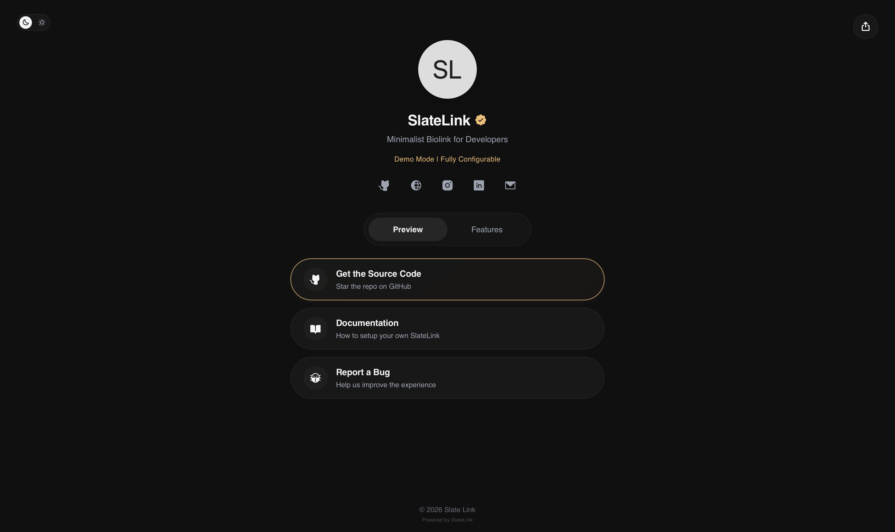

<h1 align="center">🪨 SlateLink</h1>
<h3 align="center">
  A minimalist biolink engine for technical professionals.
</h3>

<p align="center">
  
  
  
  
  

  <a href="https://github.com/javierrayhan/SlateLink/blob/main/LICENSE">
    
  </a>
</p>

<p align="center">
  <a href="https://slate.zavieray.my.id">Live Demo</a>&nbsp;&nbsp;&nbsp;|&nbsp;&nbsp;&nbsp;
  <a href="https://docs.javierrayhan.my.id">Documentation</a>&nbsp;&nbsp;&nbsp;|&nbsp;&nbsp;&nbsp;
  <a href="https://github.com/javierrayhan/SlateLink/issues">Report Issue</a>
</p>

---

<p align="center">
  
</p>

---

## 🛠️ Technical Capabilities

SlateLink is built with a focus on modularity and user-centric design tokens.

- ### Zero-Trust Domain Validation
  - **Anti-Spoofing Engine:** Integrated logic that monitors the active hosting environment.
  - **Auto-Penalty:** Unauthorized mirrors automatically lose "Verified" status.
  - **Apple-style Alerts:** Triggers a minimalist, glassmorphic security pill to warn visitors of unofficial clones.

- ### Typographic Granularity
  - **Decoupled Logic:** Structural layout is separated from typographic decisions.
  - **Granular Control:** Configure unique font families and weights for every UI element (Profile, Tabs, Cards).
  - **Centralized Tokens:** All variables are managed within a single `:root` config for rapid iteration.

- ### Native Environment Sync
  - **Adaptive Theming:** Buttery-smooth transitions between Light and Dark modes.
  - **System Awareness:** Automatic detection of user OS preferences.
  - **State Persistence:** Persistent management via `localStorage` for a consistent returning user journey.

- ### Share Integration
  - **Native Web Share API:** Leverages mobile-native share drawers for a premium UX.
  - **Resilient Fallback:** Automatically triggers a clipboard copy if HTTPS or secure context is unavailable.

- ### Performance Engineering
  - **Zero Dependencies:** No heavy libraries, frameworks, or bloat.
  - **Bare Metal Speed:** Minimalist DOM structure for near-instant execution.
  - **Responsive Fluidity:** Adaptive layouts optimized for everything from iPhone SE to ultra-wide monitors.

---

## 📊 Benchmarking: SlateLink vs. Managed Solutions

| Metric                 | Managed Platforms (Linktree) |          SlateLink          |
| :--------------------- | :--------------------------: | :-------------------------: |
| **Data Ownership**     |    Third-party controlled    |     **100% Sovereign**      |
| **Branding Control**   |   Restricted / Watermarked   |   **Whitelabel Freedom**    |
| **Security**           |           Generic            |  **Active Domain Locking**  |
| **Latency**            |      Network dependent       | **Instant Local Execution** |
| **Aesthetics**         |        Template-bound        |   **Design Token Driven**   |
| **Ad-free Experience** |      Only on paid tiers      |    **Clean by Default**     |

---

## 📦 Quick Start

SlateLink is architected for a **zero-friction** deployment workflow.

1.  **Repository Initialization**
    ```bash
    git clone https://github.com/javierrayhan/SlateLink.git
    ```
2.  **Configuration**
    - Open folder `src`
    - Configure your data in `js/config.js` (profile, links, etc.)
    - Customize styling in `css/style.css`
3.  **Launch**
    - Deploy to any static host (GitHub Pages, Vercel, Netlify).
    - **No build process required.**

---

## 📖 Extended Documentation

For deep-dive customization, including modifying animation physics or integrating third-party analytics, please refer to our technical guides:

👉 [**View Technical Documentation (SOON)**](docs.javierrayhan.my.id)

---

## 🤝 Support & Transparency

SlateLink is an open-source project. While the "Powered by SlateLink" attribution in the footer is optional, maintaining it helps support the project’s growth and reach within the developer community.

**Co-architected with transparency by [Javier Rayhan](https://github.com/javierrayhan) & Gemini 3.1 Pro.**
